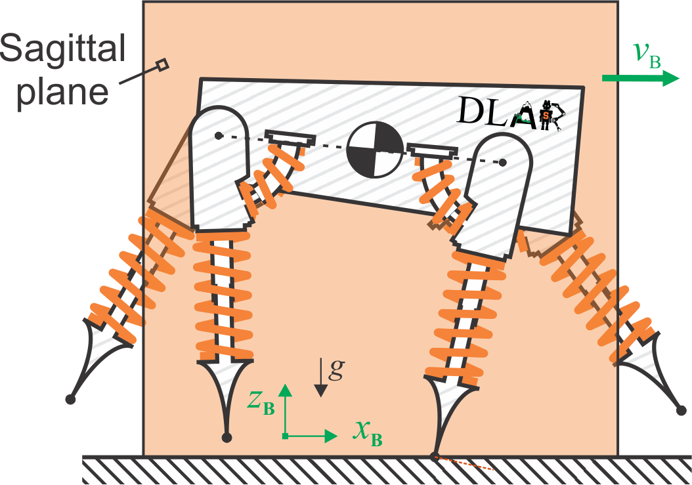

# BreakingSymmetryLeadstoDiverseGaits

## Overview

This file illustrates the exemplary solutions of a quadrupdel system: pronking, bounding, half-bounding and galloping.
The symmetries of the solutions are also demonstrated and illustrated, as well as the solution search process.

Contents:
* **Section 1:** Exemplary Solutions
* **Section 2:** Symmetry Illustrations
* **Section 3:** Solution Searching

Features:

* **Quadrupedal Dynamics:** Developed for a 2-D simplified SLIP model that is able reproduce muliple quadrupedal gaits.
* **Visualizations:** Developed the the dynamical model above, which is able to generate the animations and the trajectories of any solutions. 
* **Numerical Continuations:** Function that is able to search for 1-D solution branch for the dynamical model above.

This is research code, expect that it changes often and any fitness for a particular purpose is disclaimed.

The source code is released under a [BSD 3-Clause license](LICENSE).

**Author: Jiayu Ding 
Affiliation: [DLAR Lab](https://dlarlab.syr.edu) 
Maintainer: Jiayu Ding, jding14@syr.edu />**
With contributions by: Zhenyu Gan, C. David Remy

This projected was initially developed at Syracuse University (Dynamic Locomotion and Robotics Lab).

## Publications

This work has been submitted to IEEE Robotics and Automation Letters (RAL).

If you use this work in an academic context, please cite the following publication:

> J. Ding and Z. Gan
> **"Breaking Symmetries Leads to Diverse Quadrupedal Gaits"**,
> https://doi.org/10.48550/arXiv.2303.04857

    @misc{https://doi.org/10.48550/arxiv.2303.04857,
      doi = {10.48550/ARXIV.2303.04857},
      url = {https://arxiv.org/abs/2303.04857},
      author = {Ding,  Jiayu and Sanyal,  Amit K. and Gan,  Zhenyu},
      keywords = {Robotics (cs.RO),  Systems and Control (eess.SY),  FOS: Computer and information sciences,  FOS: Computer and information sciences,  FOS: Electrical engineering,  electronic engineering,  information engineering,  FOS: Electrical engineering,  electronic engineering,  information engineering},
      title = {Breaking Symmetries Leads to Diverse Quadrupedal Gaits},
      publisher = {arXiv},
      year = {2023},
      copyright = {arXiv.org perpetual,  non-exclusive license}
    }

## Requirements

This code requires a MATLAB version later than MATLAB R2019b.

## Usage

Readers can simply open 'Demo_Main.m' and hit the 'Run' button to follow the whole demo code.

Readers can also run any individual section if interested by hitting the 'Run Section' button, or navigate to the foler of each section and run 'Section_X_XXXX'.